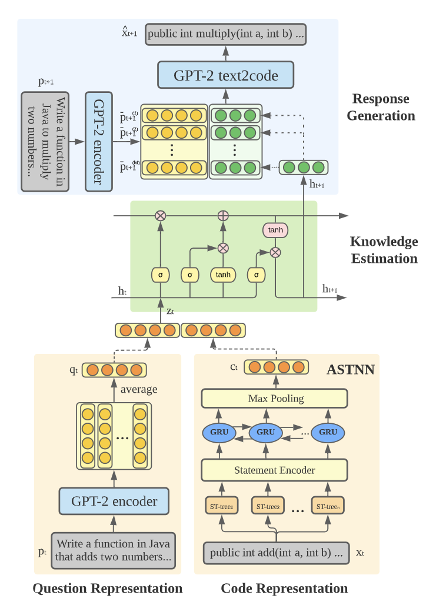

# OKT

**OKT** provides the first exploration into open-ended knowledge tracing by studying the new task of predicting students’ exact open-ended responses to questions. This repository contains code for [Open-Ended Knowledge Tracing for Computer Science Education](https://arxiv.org/abs/2203.03716)

A block diagram of OKT is shown here:

### Dependencies

### Training OKT

